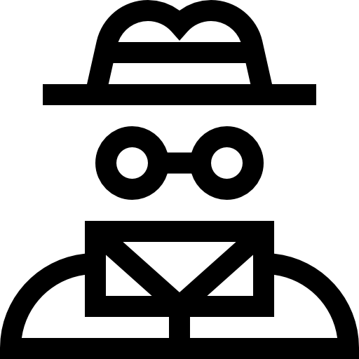
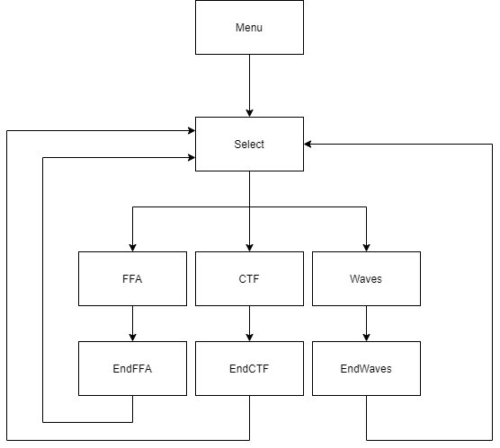

<h1 align="center">
   
  Invisible FPS
</h1>

 Um jogo FPS splitscreen desenvolvido em Unity 2020.3.2f1 para a unidade curricular de <a href="www.di.ubi.pt/~agomes/cgjd/">Computação Gráfica em Jogos Digitais</a>.

&nbsp; &nbsp; 

## ⚡️ Quick Start

Caso pretenda apenas executar o jogo poderá realizá-lo através do download do executável na aba dos [*releases*](https://github.com/dario-santos/InvisibleFPS/releases) no repositório GitHub.

Caso pretenda realizar edições no código fonte terá que:

1 - Proceder à transferência do código fonte na página do [GitHub](https://github.com/dario-santos/InvisibleFPS);
2 - Transferir e instalar o [Unity 2020.3.2f1](https://store.unity.com/download). Após isso é apenas necessário importar o projeto para o Unity e proceder à sua abertura.

## 📖 Modos de Jogo

O jogo desenvolvido possui três modos distintos de jogo até quatro jogadores cada.

### Todos contra todos

Um modo de jogo que apela a luta frenética sem alianças entre os jogadores. Após passados cinco minutos, o jogador que tiver acumulado mais *kills* é coroado vencedor.

### Capturar Bandeira

Bandeiras aparecem, em lugares pré-definidos, aleatóriamente - para pontuar, um jogador terá que ir ao seu encontro a trazê-la até à sua base, porém, um jogador que esteja na posse desta, far-se-á um alvo fácil! Após cinco minutos, o jogador tiver acumulado mais bandeiras, é coroado o vencedor.

### Ondas

Neste modo de jogo os jogadores põe de lado as suas diferenças para protegerem em conjunto uma base de ondas de inimigos: *hoverbots* e, por vezes, o *hoverbot omega* marcham incessantemente até à base dos jogadores, sendo que a sua durabilidade diminiu por um sempre que um inimigo lhe trespassa.
Assim, sem tempo limite, os jogadores defendem a sua base onda após onda de inimigos, sendo que a tarefa fica progressivamente mais difícil!

## 🎮 Mecanicas

O jogo suporta até quatro jogadores, sendo o primeiro jogador no teclado e os restantes 3 em comandos. A tabela a baixo ilustra o mapeamento das teclas com as respetivas ações.

| Ação          | Teclado & Mouse     | Comando (Layout PS4) |
| :-:           | :-:                 | :-:                  |
| Mover Jogador | `W`, `A`, `S` e `D` | `Analógico Esquerdo` |
| Mover Camera  | `Movimento Mouse`   | `Analógico Direito`  |
| Disparar      | `Mouse 1`           | `R1`  |
| Mirar         | `Mouse 2`           | `L1`  |
| Alternar Armas| `1`, `2` e `3`      | `Dpad Right` e `Dpad Left`|
| Agachar       | `CTRL`              | `R3`  |
| Correr        | `SHIFT`             | `L3`  |
| Saltar        | `SPACE`             | `X`   |

O jogo também dispõe de três armas, uma submetrelhadora uma caçadeira e um lança granadas.

## 📺 Fluxo do Jogo

A figura abaixo demonstra o fluxo do jogo entre as diferentes cenas desenvolvidas.

## 📝 Pequena Descrição das Abordagem

Para este trabalho foram utilizados diversos mecanismos oferecidos pelo motor de jogo Unity. Especificando ferramentas como:

- NavMesh - Para pathfinding;
- ScriptableObjects - Objetos de código independentes às cenas utilizados para se removerem dependências entre módulos;
- *RenderToTexture* - Renderização da visão de uma camera para uma textura;
- Unity Input System V2 - O novo sistema de *input* do Unity ainda em fase beta.

## ❤️ Agradecimentos

O nível de polidez deste jogo foi apenas possível graças a todos os *testers*.

